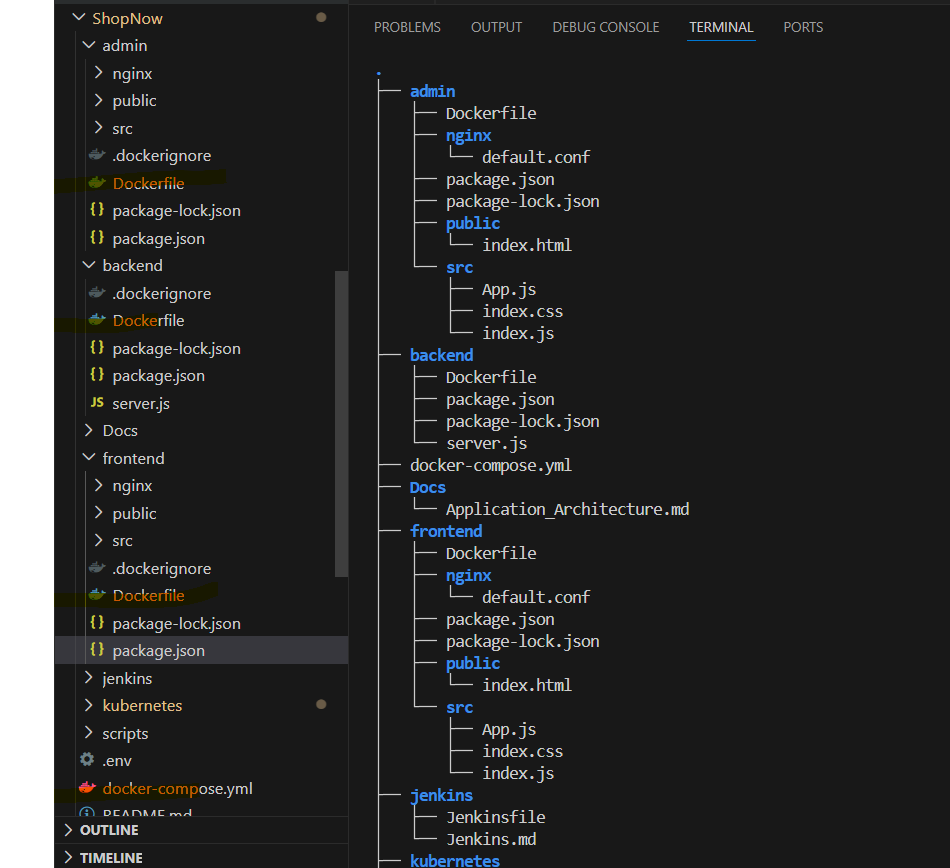
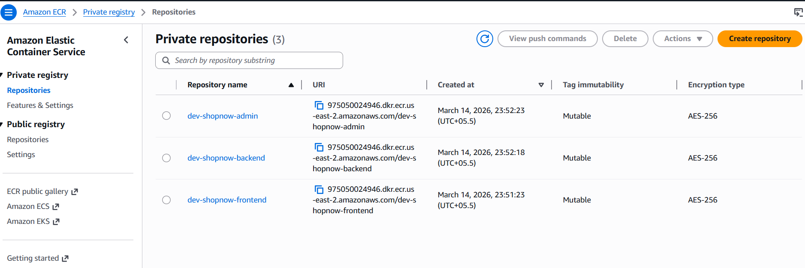
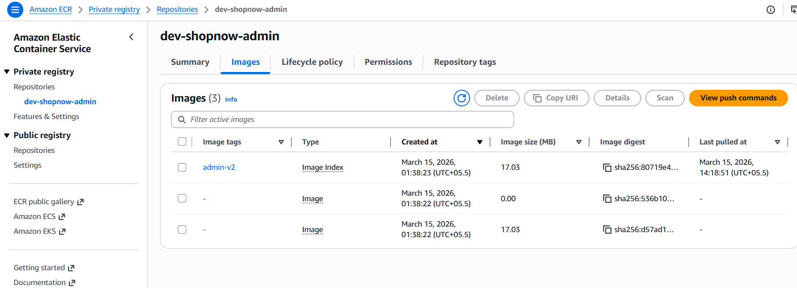
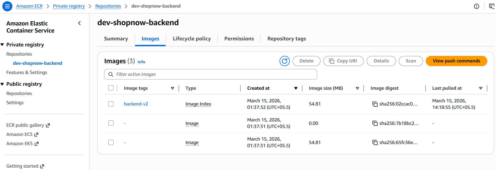
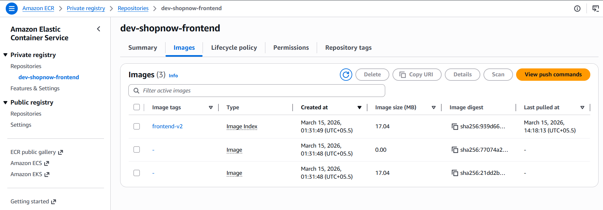
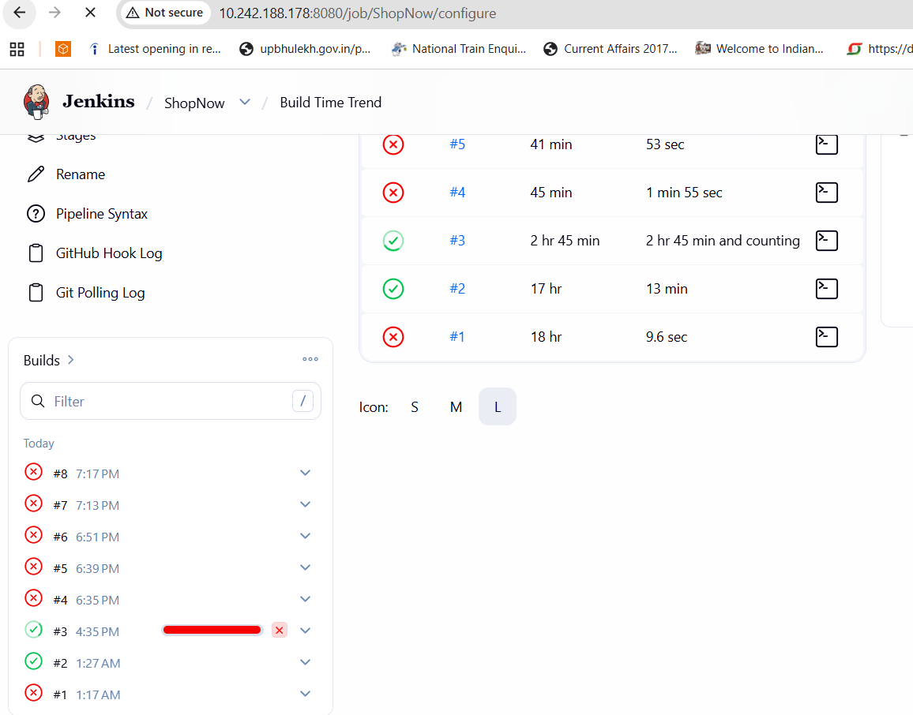
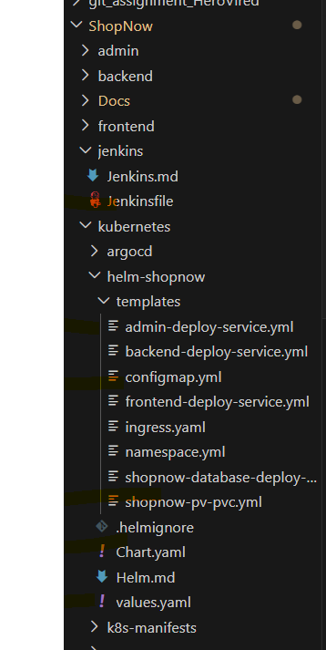
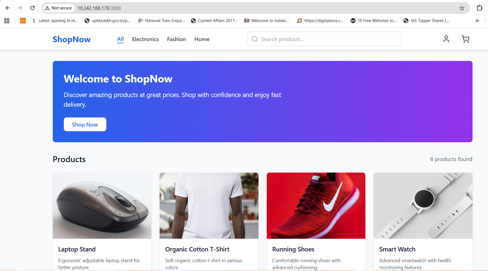
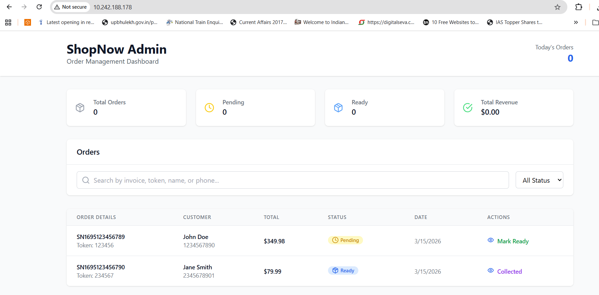
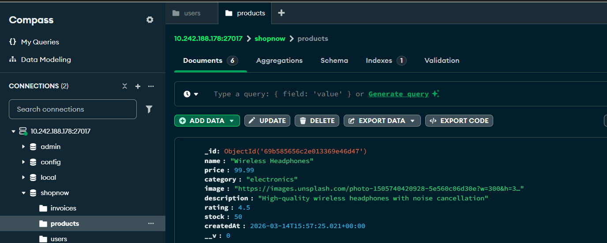

<h1> Assignment on Container Orchestration </h1>

## Architecture

| Service | Port | Description |
| --- | --- | --- |
| `adminService` | 3003 | Dedicated admin microservice for asset management and uploads |
| `frontend` | 3000 | React SPA with revamped UI and integrated chat |
| `mongo` | 27017 | Shared MongoDB instance 

All backend services share common database models and utilities through `backend/common`.

<h2>Task 1: Version Control with Git</h2>
Created the main repository into GitHub account to Maintain version by syncing/pushing updates from the main repository as needed.

<h2>Task 2: MERN Application Containerize the Application by Creating Dockerfiles for each component (Admin,Frontend and Backend)</h2>
<h3>Docker files are created for Frontend along with Docker-Compose file.</h3>



<h3> Creation of ECR Repos based on front-end and backend.
ECR Repo for frontend and backend created.

<h2>Task 3: Creation of pipeline and if success push those images to ECR repos.</h2>
Jenkins file created for complete flow from builing of Images to Pushing docker images to ECR Server with Post Actions.
[text](https://github.com/predatordev1/ShopNow/blob/main/jenkins/Jenkinsfile)

```bash
aws ecr describe-repositories --region us-east-2
aws ecr create-repository --repository-name dev-shopnow-frontend --region us-east-2
aws ecr create-repository --repository-name dev-shopnow-backend --region us-east-2
aws ecr create-repository --repository-name dev-shopnow-admin --region us-east-2
aws ecr create-repository --repository-name dev-shopnow-mongo --region us-east-2
aws ecr describe-repositories --region us-east-2

```


<h2>Task 3: Creation of pipeline and if success push those images to ECR repos.</h2>
Jenkins file created for complete flow from builing of Images to Pushing docker images to ECR Server with Post Actions.

```bash
 Inlcuded below stages
  - Testing of AWS Configuration to login ECR Repo.
  - Building images for all Microservices
  - Tagging all Created Docker images based on Frontend and backend scope.
  - Post clean up and email notifications.
```

<h3> Docker images pushed to Respective ECR Repos.</h3>





Pipeline auto started once i made any push.



<h2>Task 4: Creation of minikube Cluster and deployment app using HELM Package.</h2>
Installation of Helm and adding the Helm repo.

```bash
helm repo add ingress-nginx https://kubernetes.github.io/ingress-nginx -n streaming-app
helm repo update 
helm upgrade --install ingress-nginx ingress-nginx/ingress-nginx -n ingress-nginx --create-namespace --set controller.service.type=LoadBalancer --set controller.ingressClassResource.name=nginx --set controller.ingressClassByName=true -n streaming-app -n shopnow

```

Create all files like deployment ,Service, Ingress, ConfigMap, Namespace ,Database Volume and dB PVC.



Make sure don't include secrets in git hub so create secreats in Kubernets cluster only like AWS_ACCESS_KEY_ID/AWS_SECRET_ACCESS_KEY and JWT_SECRET using

```bash

kubectl create secret docker-registry ecr-secret \
  --docker-server=975050024946.dkr.ecr.us-east-2.amazonaws.com \
  --docker-username=AWS \
  --docker-password=$(aws ecr get-login-password --region us-east-2) \
  -n shopnow

kubectl create secret generic shopnow-secrets \
  --from-literal=AWS_ACCESS_KEY_ID="Your_aws_access_key" \
  --from-literal=AWS_SECRET_ACCESS_KEY="your_secret_access_key" \
  -n shopnow

```
At this point all required files are created and and ready to deploy using Helm with below command.

```bash
helm install shopnow

```

After dployment check if all PODs and services are running and Pods are healty.

```bash
kubectl get pods -n streaming-app
kubectl get svc -n streaming-app

```
At this point complete app is fully deployed and running without any issue.

## Step 1: Initial Registration & Login

1. **Access the Website**
   Open your preferred web browser and navigate to the application's URL. If you are running locally, go to:
   [text](http://10.242.188.178:3000/)

---
## Step 2: Access Administrator Dashboard
[text](http://10.242.188.178)


```bash
kubectl exec -it <mongodb-pod-name> -n shopnow -- mongosh shopnow

```
Promote the User Role Once you see the MongoDB prompt (test>), run the following javascript command to create admin access.
```bash

docker exec -it shopnow-mongo-1 mongosh --eval '
  use("admin");
  db.createUser({
    user: "shopuser",
    pwd: "ShopNowPass123",
    roles: [
      { role: "readWrite", db: "shopnow" },
      { role: "dbAdmin", db: "shopnow" }
    ]
  });

```
You should see an output confirming the matchedCount: (OK 1).
Exit the Database Type exit and press enter to return to your normal computer terminal.

---
*Happy Shoping!*


